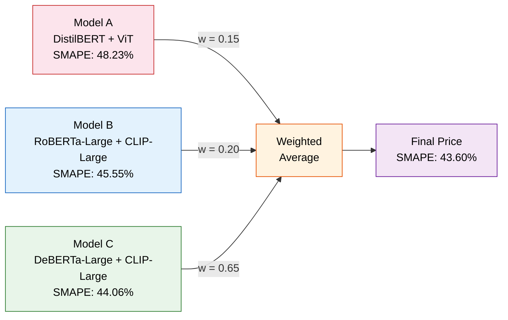
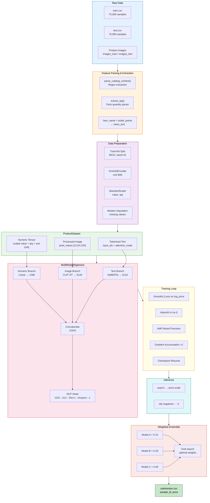
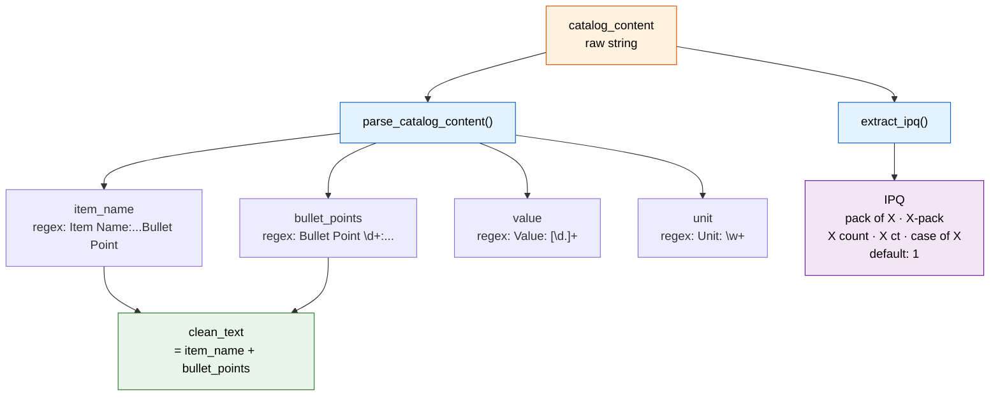
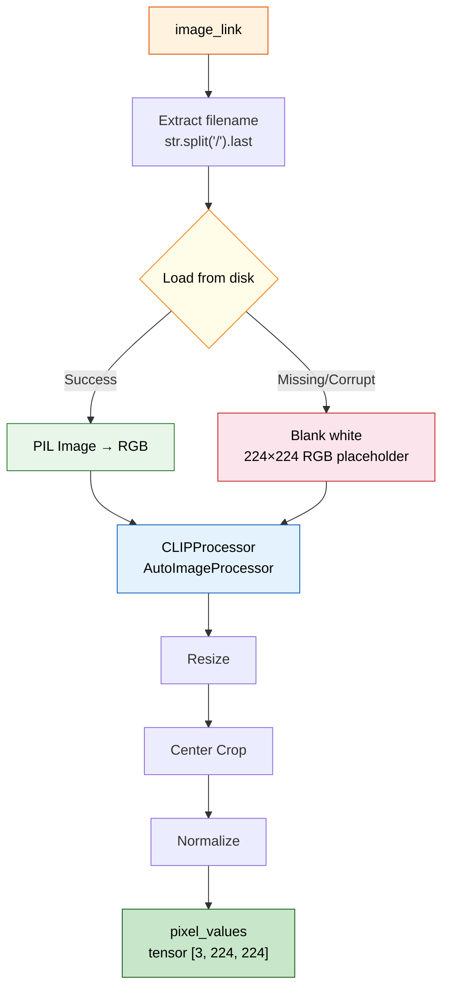
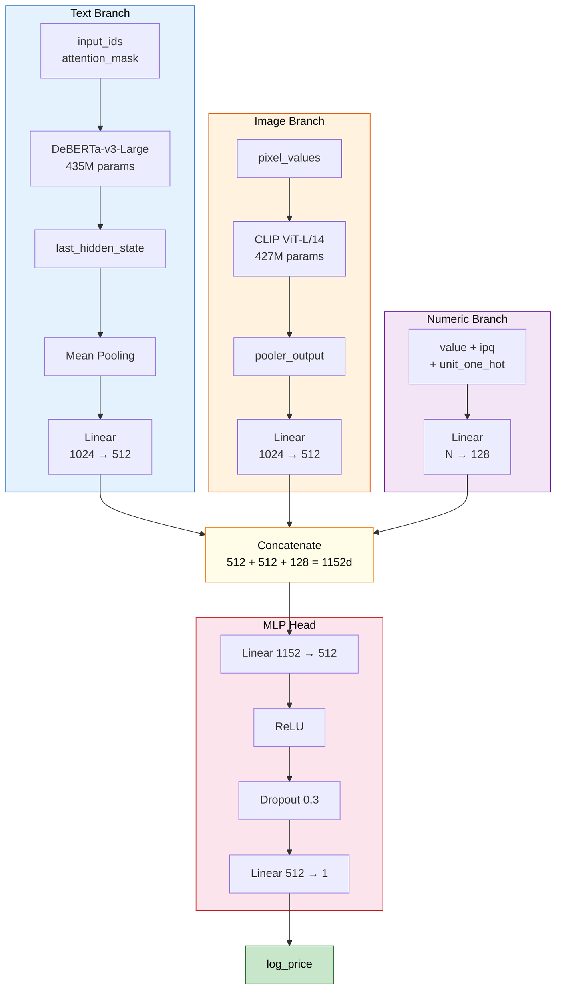
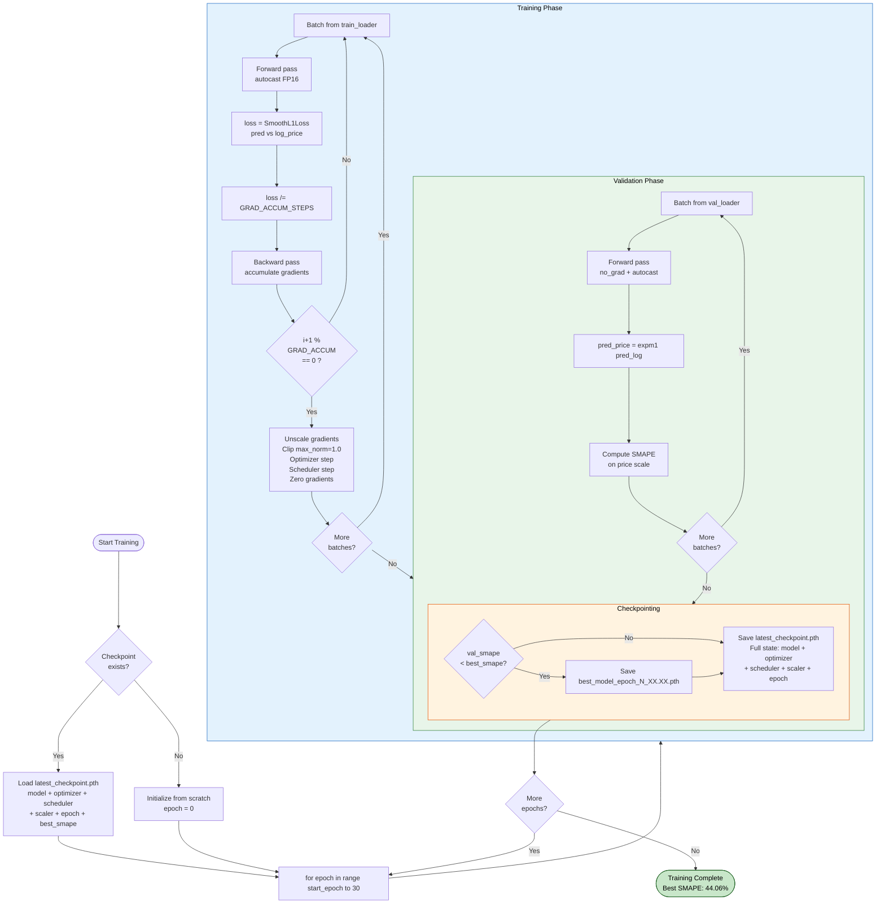
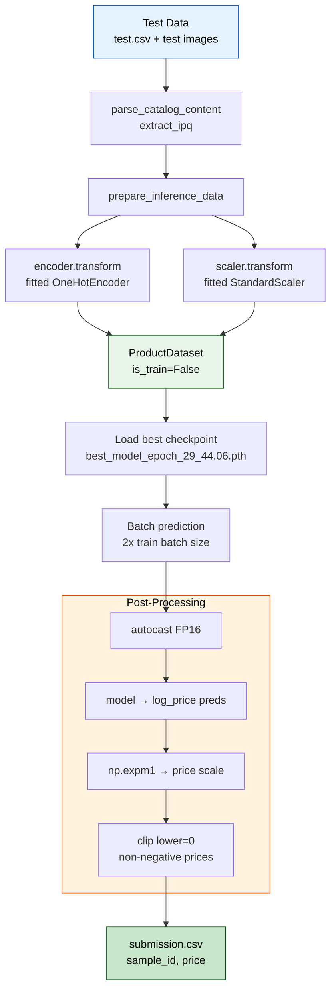
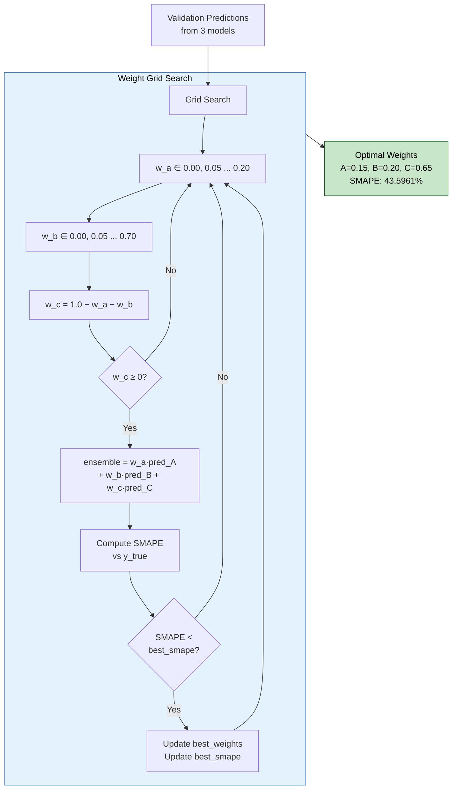
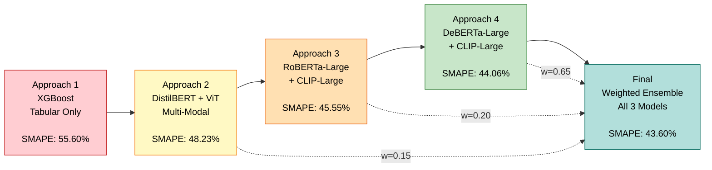
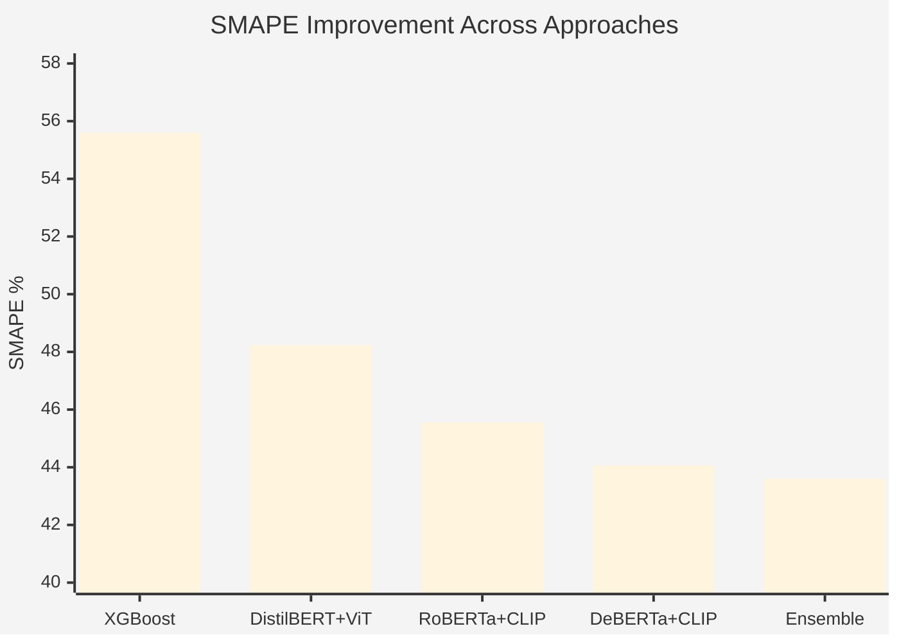

# Amazon ML Challenge 2025 — Smart Product Pricing Engine

### Team: **The_Predictors**

---

## Table of Contents

1. [Problem Statement](#1-problem-statement)
2. [Key Insights & Observations](#2-key-insights--observations)
3. [Solution Overview](#3-solution-overview)
4. [End-to-End Workflow](#4-end-to-end-workflow)
5. [Data Processing Pipeline](#5-data-processing-pipeline)
6. [Model Architecture](#6-model-architecture)
7. [Training Pipeline](#7-training-pipeline)
8. [Inference Pipeline](#8-inference-pipeline)
9. [Ensemble Strategy](#9-ensemble-strategy)
10. [Evolution of Approaches](#10-evolution-of-approaches)
11. [Results](#11-results)
12. [Tech Stack](#12-tech-stack)
13. [Repository Structure](#13-repository-structure)
14. [How to Reproduce](#14-how-to-reproduce)

---

## 1. Problem Statement

Predict the **price** of a product given multi-modal inputs:
- **Text** — product catalog content (item name, bullet points, metadata)
- **Images** — product photos
- **Structured data** — value, unit, pack quantity

**Evaluation Metric:** SMAPE (Symmetric Mean Absolute Percentage Error)

$$\text{SMAPE} = \frac{100\%}{n} \sum_{i=1}^{n} \frac{|y_i - \hat{y}_i|}{(|y_i| + |\hat{y}_i|) / 2}$$

---

## 2. Key Insights & Observations

| Insight | Impact |
|---------|--------|
| SMAPE penalizes relative errors heavily on low-price items | Predict `log(price + 1)` instead of raw price |
| `catalog_content` contains structured metadata hiding in free text | Regex-based extraction of `item_name`, `bullet_points`, `value`, `unit` |
| **IPQ** (Item Pack Quantity) is a strong numerical signal | Dedicated regex parser for pack sizes |
| Some images are missing or corrupted | Fallback to blank white 224×224 placeholder |
| Price distribution is heavily right-skewed | Log transformation normalizes the target |
| Larger transformer encoders consistently yield lower SMAPE | Final model uses DeBERTa-v3-Large + CLIP ViT-L/14 |

---

## 3. Solution Overview

Our final solution is a **weighted ensemble of 3 multi-modal transformer models**, each fusing text, image, and numerical features through a shared MLP regressor head.



---

## 4. End-to-End Workflow



---

## 5. Data Processing Pipeline

### 5.1 Text Feature Extraction



### 5.2 Numerical Feature Engineering

| Step | Operation |
|------|-----------|
| 1 | Extract `value` (float), `ipq` (int), `unit` (string) |
| 2 | Fill missing `value` with training set **median** |
| 3 | **One-Hot Encode** `unit` via `sklearn.OneHotEncoder` |
| 4 | **StandardScaler** on `[value, ipq]` (fit on train, transform val/test) |
| 5 | Final numeric tensor = `[scaled_value, scaled_ipq, unit_one_hot...]` |

### 5.3 Image Processing



### 5.4 Text Tokenization

- **Tokenizer:** `AutoTokenizer` matching the text encoder model
- **Max Length:** 128 tokens
- **Strategy:** truncation + padding to `max_length`
- **Output:** `input_ids` + `attention_mask`

### 5.5 Target Transformation

```python
log_price = np.log1p(price)       # Training target
predicted_price = np.expm1(pred)   # Back-transform at inference
```

---

## 6. Model Architecture

### 6.1 MultiModalRegressor (Final Model — DeBERTa + CLIP)



### 6.2 Model Variants

| Component | Model A | Model B | Model C (Final) |
|-----------|---------|---------|-----------------|
| **Text Encoder** | DistilBERT-base-uncased | RoBERTa-Large | DeBERTa-v3-Large |
| **Text Params** | ~66M | ~355M | ~435M |
| **Image Encoder** | ViT-base-patch16-224 | CLIP ViT-L/14 | CLIP ViT-L/14 |
| **Image Params** | ~86M | ~427M | ~427M |
| **Total Params** | ~152M | ~782M | **738.83M** |
| **Pooling** | pooler_output | pooler_output | mean-pool (last_hidden_state) |
| **Val SMAPE** | 48.23% | 45.55% | **44.06%** |

---

## 7. Training Pipeline

### 7.1 Hyperparameters

| Parameter | Value |
|-----------|-------|
| Optimizer | AdamW |
| Learning Rate | 1e-5 |
| Loss Function | SmoothL1Loss (Huber Loss) |
| Scheduler | Linear (no warmup) |
| Physical Batch Size | 16 |
| Gradient Accumulation Steps | 2 |
| **Effective Batch Size** | **32** |
| Epochs | 30 |
| Max Sequence Length | 128 |
| Dropout | 0.3 |
| Gradient Clipping | 1.0 |
| Mixed Precision | AMP (autocast + GradScaler) |
| Train/Val Split | 90/10 (seed=42) |

### 7.2 Training Flow



### 7.3 Resume-Safe Checkpointing

The training pipeline supports **full checkpoint resumption**, saving:
- Model weights
- Optimizer state (momentum buffers, etc.)
- LR Scheduler state
- AMP GradScaler state
- Current epoch & best SMAPE

This allowed resuming after epoch 20 with reduced batch size (32 → 16) and gradient accumulation (×2) to avoid OOM errors while maintaining the same effective batch size.

---

## 8. Inference Pipeline



---

## 9. Ensemble Strategy

### 9.1 Weight Optimization via Grid Search

Optimal weights were found by **grid search** over the validation set:



### 9.2 Final Weights

| Model | Architecture | Individual SMAPE | Ensemble Weight |
|-------|-------------|------------------|-----------------|
| **A** | DistilBERT + ViT | 48.23% | 0.15 |
| **B** | RoBERTa-Large + CLIP-Large | 45.55% | 0.20 |
| **C** | DeBERTa-Large + CLIP-Large | 44.06% | **0.65** |

### 9.3 Final Ensembled SMAPE: **43.5961%**

The ensemble outperforms the best single model (44.06%) by ~0.46 percentage points.

---

## 10. Evolution of Approaches





| Approach | Model | Key Change | SMAPE |
|----------|-------|------------|-------|
| 1 | XGBoost (GPU) | Baseline — TF-IDF + tabular features, no images | 55.60% |
| 2 | DistilBERT + ViT | First multi-modal (text+image+numeric) deep learning model | 48.23% |
| 3 | RoBERTa-Large + CLIP-Large | Scaled up text & image encoders | 45.55% |
| 4 | DeBERTa-v3-Large + CLIP-Large | Strongest encoders, mean-pooling, gradient accumulation, 30 epochs | 44.06% |
| **Final** | **Weighted Ensemble (A+B+C)** | **Grid-searched weights across 3 models** | **43.60%** |

---

## 11. Results

### 11.1 Validation Performance (10% Holdout)

| Metric | Best Single Model | Ensemble |
|--------|-------------------|----------|
| **SMAPE** | 44.06% | **43.5961%** |

### 11.2 Model Parameter Counts

| Model | Total Parameters |
|-------|-----------------|
| Model A (DistilBERT + ViT) | ~152M |
| Model B (RoBERTa-Large + CLIP-Large) | ~782M |
| Model C (DeBERTa-Large + CLIP-Large) | **738.83M** |

### 11.3 Dataset Statistics

| Split | Samples |
|-------|---------|
| Training | 75,000 (4 columns) |
| Test | 75,000 (3 columns) |
| Train split | 67,500 (90%) |
| Validation split | 7,500 (10%) |

---

## 12. Tech Stack

| Category | Tools & Libraries |
|----------|-------------------|
| **Deep Learning** | PyTorch, PyTorch AMP |
| **Transformers** | HuggingFace Transformers (AutoModel, AutoTokenizer, CLIPModel, CLIPProcessor) |
| **NLP Models** | DeBERTa-v3-Large, RoBERTa-Large, DistilBERT |
| **Vision Models** | CLIP ViT-L/14, ViT-base-patch16-224 |
| **ML Baseline** | XGBoost (GPU — `gpu_hist`), RAPIDS (cuDF, cuML) |
| **Preprocessing** | scikit-learn (OneHotEncoder, StandardScaler, train_test_split) |
| **Data** | Pandas, NumPy |
| **Image** | Pillow (PIL) |
| **Compute** | NVIDIA GPU (CUDA) |
| **Environment** | Jupyter Notebook |

---

## 13. Repository Structure

```
Amazon-ML-Challange/
│
├── README.md                              # Project overview (root)
│
├── dataset/
│   ├── train.csv                          # 75,000 training samples
│   └── test.csv                           # 75,000 test samples
│
├── images_train/                          # Training product images
├── images_test/                           # Test product images
│
├── appraoch 1/                            # XGBoost baseline
│   ├── Documentation.md
│   ├── test.ipynb
│   └── submissionxgb.csv
│
├── approach 2/                            # DistilBERT + ViT
│   ├── test1 (1).ipynb
│   ├── submission_45.55_model.csv
│   └── submission_48.39_model.csv
│
├── approach 3/                            # RoBERTa-Large + CLIP-Large
│   ├── approach.md
│   ├── test_roberta-large_clip-large.ipynb
│   ├── submission_45.55_model.csv
│   ├── submission_average_ensemble.csv
│   └── submission_average_ensemble1.csv
│
├── approach 4/                            # DeBERTa-v3-Large + CLIP-Large
│   ├── approach4.md
│   ├── main.ipynb
│   └── submission_deberta_large_clip-large_44.06.csv
│
└── Final_submission/                      # FINAL SOLUTION
    ├── README.md                          # This file
    ├── main7.ipynb                        # Complete pipeline notebook
    └── submission_ensembled_final2.csv    # Final submission file
```

---

## 14. How to Reproduce

### Prerequisites

```bash
pip install torch torchvision transformers scikit-learn pandas numpy pillow tqdm timm
```

### Steps

1. **Place data** in `../dataset/` (`train.csv`, `test.csv`) and images in `../images_train/`, `../images_test/`

2. **Train individual models** — Run the training cells in `main7.ipynb`:
   - Configure `Config.TEXT_MODEL` and `Config.IMAGE_MODEL` for each variant
   - Training supports resume from checkpoint

3. **Generate validation predictions** — Save per-model validation predictions for weight optimization

4. **Find ensemble weights** — Run the grid search cell to find optimal blending weights on validation set

5. **Generate final submission** — Apply ensemble weights to test predictions → `submission_ensembled_final2.csv`

### GPU Requirements

| Model | Approx. VRAM |
|-------|-------------|
| Model A (DistilBERT + ViT) | ~8 GB |
| Model B (RoBERTa + CLIP-L) | ~20 GB |
| Model C (DeBERTa + CLIP-L) | ~20 GB |

> Mixed precision (AMP) and gradient accumulation are used to fit large models in limited VRAM.

---

<p align="center">
  <b>Final SMAPE: 43.5961%</b><br>
  <i>Amazon ML Challenge 2025 — Team The_Predictors</i>
</p>
